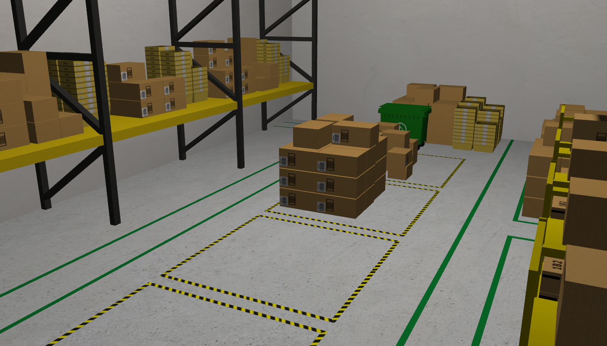
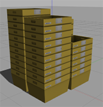
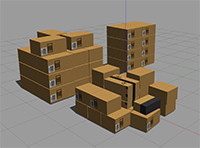
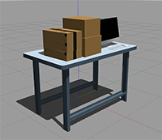
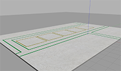
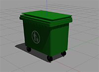
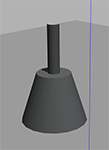
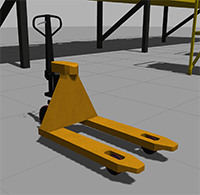
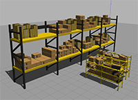

# AWS RoboMaker Small Warehouse World




This Gazebo world is well suited for organizations who are building and testing robot applications for warehouse and logistics use cases. 

## 3D Models included in this Gazebo World

| Model (/models)       | Picture           |
| :------------- |:-------------:|
| **aws_robomaker_warehouse_Bucket_01**    | 
| **aws_robomaker_warehouse_ClutteringA_01, aws_robomaker_warehouse_ClutteringC_01, aws_robomaker_warehouse_ClutteringD_01**     |  |
| **aws_robomaker_warehouse_DeskC_01**    | 
| **aws_robomaker_warehouse_GroundB_01**    | 
| **aws_robomaker_warehouse_TrashCanC_01**   | 
| **aws_robomaker_warehouse_Lamp_01**    | 
| **aws_robomaker_warehouse_PalletJackB_01**    | 
| **aws_robomaker_warehouse_ShelfD_01, aws_robomaker_warehouse_ShelfE_01, aws_robomaker_warehouse_ShelfF_01**    | 

## Building and Launching the Gazebo World with your ROS Applications

* Create or update a **.rosinstall** file in the root directory of your ROS workspace. Add the following line to **.rosintall**:
    ```
    - git: {local-name: src/aws-robomaker-small-warehouse-world, uri: 'https://github.com/aws-robotics/aws-robomaker-small-warehouse-world.git', version: foxy-devel}
    ```
* Change the directory to your ROS workspace and run `rosws update`

* Add the following include to the ROS2 launch file you are using:
    ```python
    import os

    from ament_index_python.packages import get_package_share_directory
    from launch import LaunchDescription
    from launch.actions import IncludeLaunchDescription
    from launch.launch_description_sources import PythonLaunchDescriptionSource

    def generate_launch_description():
        warehouse_pkg_dir = get_package_share_directory('aws_robomaker_small_warehouse_world')
        warehouse_launch_path = os.path.join(warehouse_pkg_dir, 'launch')

        warehouse_world_cmd = IncludeLaunchDescription(
            PythonLaunchDescriptionSource([warehouse_launch_path, '/no_roof_small_warehouse_launch.py'])
        )

        ld = LaunchDescription()

        ld.add_action(warehouse_world_cmd)

        return ld
    ```

* Build your application using `colcon`
    ```bash
    rosws update
    rosdep install --from-paths . --ignore-src -r -y
    colcon build
    ```

## Example: Running this world directly in Gazebo without a ROS application

To open this world in Gazebo, change the directory to your ROS workspace root folder and run:

```bash
export GAZEBO_MODEL_PATH=`pwd`/models
gazebo worlds/small_warehouse.world
```

## Example: Running this world directly using ROS without a simulated robot

To launch this base Gazebo world without a robot, clone this repository and run the following commands. **Note: ROS and gazebo must already be installed on the host.** 

```bash
# build for ROS2
rosdep install --from-paths . --ignore-src -r -y
colcon build

# run in ROS2
source install/setup.sh
ros2 launch aws_robomaker_small_warehouse_world no_roof_small_warehouse_launch.py
```

**Visit the [AWS RoboMaker website](https://aws.amazon.com/robomaker/) to learn more about building intelligent robotic applications with Amazon Web Services.**

